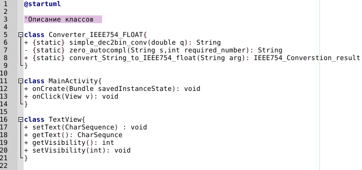

# How to add the [PlantUML](https://plantuml.com/) file type to Geany on Linux

1.	Install the `plantuml` package (For example, using `apt` on Debian)
1.	Copy `filetype.PlantUML.conf` to directory
`~/.config/geany/filedefs`
2.	Open `filetype-extensions.conf`:
`Tools->Configuration Files->filetype_extensions.conf `
3.	Add the line `PlantUML=*.plantuml;` to the `[Extensions]` section.
4.	Add `PlantUML;` to the `Markup = ...` line of the `[Groups]` section
5.	Restart Geany

## How to work with this type of files in Geany

1.	Create a new file with the extension `.plantuml`
2.	Write the code
3.	Press **[F8]** to compile the code into a png image
4.	Press **[F5]** to view the generated image in [Ristretto](https://docs.xfce.org/apps/ristretto/start)

